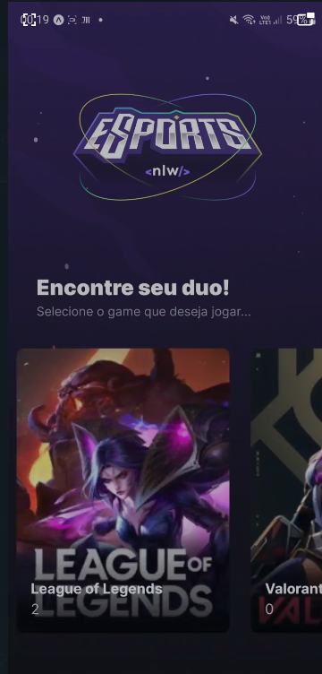
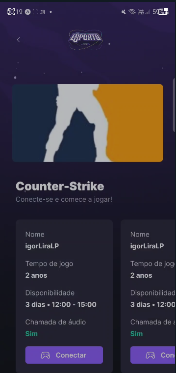
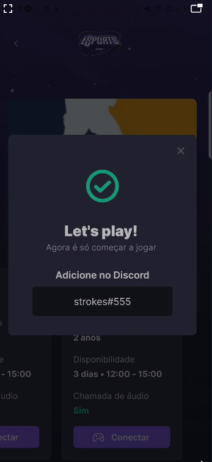

# Find Your Duo:  Mobile Version

  
  
  

My first React Native project where I could implement the core concepts of React/Angular/Vue: components and reactive variables:

- Components such as the card in the game list, the card in the duo list, inputs with common css configs, background, and others.

- Reactive DOM to display the fechted data from a node server.

# Stacks

- Reactive Native
- Expo
- TypeScript

# Screens

## Game List

Display a list of cards with the game title and number of ads. Opens the Game Screen by clicking on each card.

## Duo List

Shows all available duos for the requested game. Each duo is displayed in a card containing the duo information, such as their name, years playing, when they usually play and others. Those information are fetched from a node server.

## Modal

Presents the requested duo discord for connecting and playing together!
